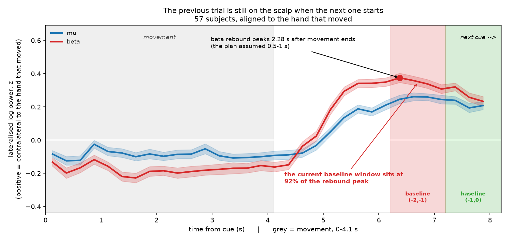
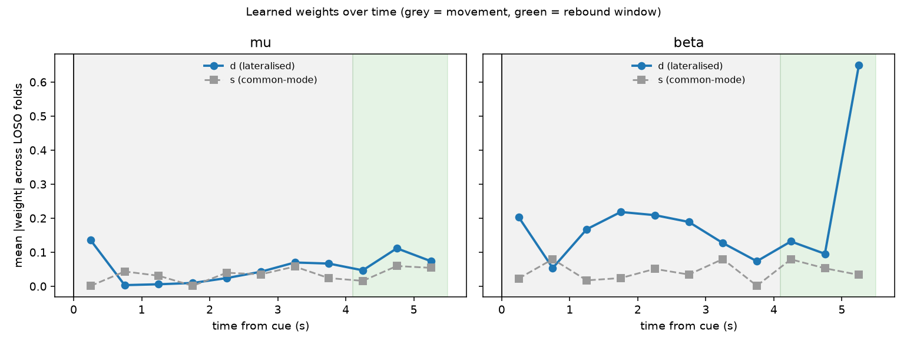

# Left vs Right Fist Decoding — EEGMMIDB

Executed left- vs right-fist movement decoding from scalp EEG (PhysioNet
EEGMMIDB, runs 3/7/11), evaluated across subjects.

**The short version:** the pipeline reaches **0.699** across 57 unseen subjects.
Most of this repository is the work of establishing what that number is actually
made of — and the answer is not what I expected. The signal is carried almost
entirely by the **post-movement beta rebound**, not by movement itself, and the
standard correction for the main confound turned out to *create* it.

---

## Quick start

```bash
python -m venv .venv && .venv/Scripts/pip install -r requirements.txt
```

```bash
python download_all.py && python train.py 57 && python run_experiments.py 57 100
```

Predict on a raw EDF the model has never seen:

```bash
python predict.py path/to/S042R03.edf
```

---

## Headline results

57 subjects, 2394 trials, leave-one-subject-out.

| | Accuracy |
|---|---|
| **Cross-subject (LOSO), pooled-rest baseline** | **0.699 ± 0.119** |
| Accuracy on *repeat* trials only (carryover cannot help) | **0.646** |
| Within-subject (leave-one-run-out) | 0.660 ± 0.145 |
| Label-permutation null | 0.500 ± 0.013 (p = 0.0099, 100 shuffles) |
| Chance | 0.500 |

Per-subject accuracy runs from **0.452 to 0.976**, with 53 of 57 above chance.
The spread is part of the result, not noise around it.

**Two numbers are worth reading together.** The headline 0.699 still contains
some carryover (see below). The 0.646 on repeat trials is the conservative
figure — on those trials a carryover-exploiting model is actively penalised, so
what survives there is genuine current-trial decoding.

---

## The finding: the standard correction makes it worse

The lateralisation index `d = log P(C3) − log P(C4)` separates the classes
**before the cue**, which no amount of motor decoding explains. The cause is
sequence structure:

- Consecutive trials use **different hands 77.1%** of the time
  (n = 2223, binomial p = 1e-151 against independent randomisation).
- Lag-2 alternation is **0.496** — chance — so this is a first-order alternation
  bias, not a longer pattern.
- The previous movement ends 4.1 s before the next cue, so its **post-movement
  beta rebound**, which sits contralateral to the *previous* hand, is still
  present when the next trial starts.

Read the previous trial's rebound, bet on alternation, score well without
decoding the current movement at all.

### Why the obvious fix backfires

The textbook response is to subtract each trial's own pre-cue baseline. I did
that, and it made the confound **worse**. The reason is a timing assumption that
does not hold in this data:

> **The beta rebound peaks 2.28 s after movement ends, not the 0.5–1 s usually
> assumed.** It is still at 64% of peak 3.85 s later, when the next cue fires.

So the (−2, −1) s pre-cue window sits at **92% of the previous trial's rebound
peak**. Subtracting it does not remove a clean baseline — it subtracts the
previous trial's rebound at nearly full strength. And because the residue has
decayed further by the time the current trial runs, the subtraction
*over-corrects*. The over-correction points opposite the previous hand, and
since hands alternate 77% of the time, that looks like the current hand.

**The correction injects the confound it was meant to remove.**



Measured, holding everything else fixed:

| Baseline scheme | Accuracy | switch | stay | carryover gap |
|---|---|---|---|---|
| **Pooled rest (used)** | 0.699 | 0.722 | 0.646 | **+0.075** |
| Trial-wise pre-cue | 0.700 | 0.729 | 0.621 | **+0.108** ← worst |
| No baseline | 0.721 | 0.741 | 0.674 | +0.067 |

Pooled rest is used instead because it is **one constant per subject**, estimated
from the T0 blocks in the same file. Having nothing that varies trial to trial,
it structurally *cannot* carry information about which hand moved last — while
still referencing every feature to that person's own resting power, which is what
makes a number mean "an ERD" at all.

### The test that proves it

Split accuracy by whether the hand **switched** or **repeated**. A genuine
current-movement decoder is indifferent; a carryover exploiter is good on
switches and poor on repeats. Drift in attention or fatigue hits both equally, so
a gap here is carryover specifically.

What closed it, measured by ablation:

| Setup | stay | gap |
|---|---|---|
| Pre-cue bins fed to the model, window to 4.1 s | 0.448 | **+0.286** |
| Pre-cue bins excluded | 0.570 | +0.108 |
| Plus the rebound window (current) | **0.646** | **+0.075** |

**Excluding the pre-cue bins from the features did about 80% of it.** Those bins
sit inside the previous trial's rebound; feeding them to the model handed it the
previous hand directly. Note the first row: stay accuracy *below chance* means
the model was actively predicting the wrong hand on repeats — the signature of
pure alternation-betting.

A residual **+0.075** gap remains and is reported, not corrected. No pre-cue
window in this paradigm is clean: even 0.25 s before the cue, the previous
rebound is still at 64% of peak.

---

## What the model is actually using

Nearly all accuracy comes from three bins *after* the hand stops:

| Bins used | Accuracy |
|---|---|
| Movement, 0–4.1 s | **0.523** |
| Post-movement, 4.1–5.5 s | **0.673** (12 features) |
| All post-cue bins | 0.699 |

This is a **post-movement beta rebound detector**, not a movement decoder, and
the learned weights say the same thing independently — 0.65 on the single beta
bin at 5.25 s against under 0.22 everywhere else.



### Why the ERD contributes so little

This looks wrong at first: the ERD is by far the largest effect in the trial.
Rest-referenced, during movement:

| | During movement | At the rebound |
|---|---|---|
| `s` = C3+C4 (both hemispheres) | **−1.07** | −0.06 |
| `d` = C3−C4 (lateralised only) | −0.25 | **+0.36** |

The ERD is about **four times larger than anything else** — but it is almost
entirely *bilateral*. Both hemispheres desynchronise when one hand moves, so an
ERD tells you *a* hand moved, not *which*. Directly:

| Component | Accuracy |
|---|---|
| `s` only (bilateral) | **0.508** — chance |
| `d` only (lateralised) | **0.706** |

The rebound, by contrast, is almost purely lateralised: at 5.25 s the bilateral
component is back at resting level (−0.06) while the lateralised component peaks
(+0.36). The model prefers the rebound not because it is bigger, but because it
is **cleaner** — nearly all of its energy lies in the direction that
distinguishes hands.

This is also the clearest evidence that the `(d, s)` basis did its job: the
rotation put 0.706 of accuracy on one axis and chance on the other.

### Feature layout: mu vs beta

| Layout | Accuracy | Features |
|---|---|---|
| A — mu fine + beta fine | 0.699 | 44 |
| B — mu **coarse** + beta fine | **0.702** | 24 |
| C — mu fine + beta **coarse** | 0.632 | 24 |

Coarsening mu costs nothing (+0.003); coarsening beta costs 0.067. Beta carries
the motor-specific signal — the claim the anti-attention argument rests on.

Mu is not uninformative, it is **redundant**: mu alone reaches 0.599, but
mu + beta (0.698) equals beta alone (0.698). It carries the same time course at
roughly half the amplitude, so a regularised model puts its weight on the
higher-SNR band.

---

## Method

```
load EDF -> standardise channel names -> screen
  -> notch 60 Hz
  -> small Laplacian on C3/C4 (each minus the mean of its 4 neighbours)
  -> band-pass mu (8-13) and beta (13-30) -> Hilbert envelope -> log power
  -> 15 non-overlapping 0.5 s bins spanning [-2, +5.5] s
  -> d = logP(C3) - logP(C4),   s = logP(C3) + logP(C4)
  -> reference to pooled T0 rest, per subject
  -> DROP pre-cue bins; the 11 post-cue bins reach the model  (44 features)
  -> L2 logistic regression, C chosen by inner leave-one-subject-out
```

**Epoch wide, feed narrow.** The epoch starts at −2 s so the pre-cue window is
available as a diagnostic, but only post-cue bins become features. Pre-cue is a
poor feature source and a powerful diagnostic — it is where the confound is
visible.

**Window ends at 5.5 s.** Movement runs 0–4.1 s and the next cue is at 8.2 s.
The window stops short of the rebound peak deliberately: a bin close to the next
cue could pick up *preparation* for the next movement, which is lateralised to
the next hand and therefore anti-correlated with the current label. That is the
carryover confound running forwards.

**Features are `(d, s)`, not `(C3, C4)`.** Same span, so a linear model can reach
the same solutions — the difference is what L2 shrinks. In this basis the
regulariser penalises the lateralised direction and the common-mode direction
independently, which is the prior I hold. Measured payoff above.

**Fixed Laplacian rather than learned CSP.** Zero fitted parameters, so nothing
can leak and it transfers to an unseen subject unchanged. CSP is fit per subject
and does not transfer; at prediction time there is one unlabelled recording and
nothing to calibrate on.

**The last trial of each run is dropped.** Recordings stop as the final movement
ends, so the analysis window runs past the end of the data — 2553 → 2394 trials.

---

## Controls

| Control | Result | Reading |
|---|---|---|
| Label permutation (100 shuffles) | null 0.500 ± 0.013, **p = 0.0099** | The effect is real |
| Trial position within run | **0.497** (best possible 0.546) | No ordering artifact |
| Per-run class balance | exactly 0.500, every run | Nothing to exploit |
| 30–50 Hz "muscle" band | 0.601 | **contaminated — see below** |
| 40–50 Hz muscle band, clean filter | **0.537** | The honest version |
| Subject-identity probe | 0.573 vs 0.018 chance | Identity is present but useless here |
| Naive random split | inflation ≈ 0.000 | Explained below |

### The muscle control, and a problem with it

EMG is the weakest point: these are executed movements, so real forearm muscle
activity reaches the scalp. The plan specified a 30–50 Hz control, which scored
0.601 — uncomfortably close to the headline.

**That control was partly broken.** With MNE's default transition bands, a
30–50 Hz filter still responds at **0.679 to 26–28 Hz** — which is high beta. It
was measuring the signal it was supposed to be a control for. With properly
separated bands (3 Hz transitions, 0.001 response at 26–28 Hz):

| Band | Response at 26–28 Hz | Accuracy |
|---|---|---|
| 30–50 Hz, defaults | 0.679 | 0.601 |
| 35–50 Hz, tight | 0.001 | 0.544 |
| 40–50 Hz, tight | 0.000 | **0.537** |

Most of the apparent muscle signal was beta leaking through a soft filter edge.
Both numbers are reported because the difference between them *is* the finding.

**What remains true:** 0.537 is still above the 0.500 ± 0.013 null — about 3 SD
out — so a small lateralised component does live up there. And the control is
weak by construction: at 160 Hz, Nyquist is 80 and mains is 60, so 40–50 Hz is a
cramped proxy for EMG, which peaks well above it. **I cannot rule out a muscle
contribution and would not claim the result is purely cortical.** The clean way
to settle it is the imagined runs, where no movement occurs.

### Why the random split shows no inflation

This surprised me and the reason matters. Random-split inflation comes from
subject identity carrying label information. Every run here is *exactly* 50/50
left/right, so knowing *who* a trial came from says nothing about *which hand*,
and leaking subject identity buys nothing. The identity probe confirms identity
is strongly present in the raw features (0.573 vs 0.018 chance, 33×) — it simply
is not useful for this label. The dangerous leak in this dataset is temporal,
not per-subject.

---

## Person vs task

| | Accuracy |
|---|---|
| Within-subject (leave-one-run-out) | 0.660 |
| Cross-subject (LOSO) | **0.699** |
| Gap | **−0.039** |

Cross-subject is *higher* than within-subject. If the model were fitting
individual quirks, training on a person should beat training on strangers — it
does not. Within-subject folds also have far less training data (~28 trials),
which contributes.

What generalisation rests on: pooled-rest referencing (raw features identify
*who* at 33× chance; referencing to each person's own rest removes it), a
Laplacian with zero fitted parameters, C3/C4 fixed anatomically rather than
selected, and heavy regularisation (C = 0.01).

Per-subject accuracy spans 0.452–0.976 with 4 of 57 below chance — consistent
with the 15–30% "BCI illiteracy" rate in the literature. `predict.py` on three
subjects outside the training set returned 0.357, 0.929, and 0.571.

---

## Assumptions and limitations

1. **The rest reference uses the whole file.** Features are referenced to that
   recording's own T0 blocks. This is label-free — it uses EEG and event
   *timing*, never the L/R label — and valid because the deliverable takes a
   complete EDF. **It would not hold for a live online BCI** seeing one trial at
   a time.
2. **Carryover is reduced, not removed.** A +0.075 switch/stay gap survives. No
   pre-cue window in this paradigm is clean, so this is reported rather than
   corrected.
3. **This decodes the rebound, not the movement.** Movement-window accuracy
   alone is 0.523. The honest description is a post-movement beta rebound
   detector. That the rebound is *hand-specific* is what makes it work; it is
   also the most carryover-prone part of the signal, which is the tension.
4. **EMG cannot be excluded.** See above.
5. **Executed movements only.** Imagined runs are the more BCI-relevant and
   harder problem, and are untouched here.
6. **57 of 109 subjects.** Every script takes a subject count, so scaling is a
   re-run of `run_experiments.py 109`.

## What I would do next

- **Imagined runs**, which settle the EMG question — no movement, no muscle.
- **Model the carryover explicitly**: estimate the previous trial's rebound as a
  decaying function of latency and regress it out, rather than subtracting a flat
  baseline. The decay curve above is what such a model would be built from.
- **Report switch/stay as the primary metric** rather than pooled accuracy. This
  dataset makes pooled accuracy misleading.
- Check whether the alternation bias affects the imagined runs identically, and
  whether published EEGMMIDB accuracies are exposed to the same inflation.
- Riemannian tangent-space features as a comparison arm.

## Repository layout

```
src/data.py                  loading, screening, epoching
src/features.py              Laplacian, Hilbert, binning, d/s, baselining
src/dataset.py               feature matrix assembly + caching
src/evaluate.py              LOSO and within-subject evaluation
src/controls.py              switch/stay, permutation, identity, naive split
src/plot_lateralisation.py   the figure that exposed the confound
src/plots.py                 result figures
make_decay_figure.py         the carryover decay curve
run_experiments.py           full sweep -> results/results.json
run_diagnostics.py           layout A/B and label-structure checks
train.py / predict.py        trained model + CLI
design.md                    the reasoning written before any code
```

## AI use

Claude (Opus 5) was used throughout: to organise notes into the design in
`design.md`, to write most of the pipeline code, and as a sounding board while
diagnosing the pre-cue separation.

Two things are worth being specific about, because they changed the result.
First, the rebound-timing measurement: the assumption that the rebound peaks
0.5–1 s after movement offset came from the literature and was wrong for this
data, and measuring it is what explained why the standard baseline correction
backfired. Second, the muscle-band control was found to be measuring beta
through a soft filter edge — a control that would have understated the result's
robustness had it been trusted.

Several suggestions were tested and discarded, including a per-sample decaying
baseline correction, which was left as future work rather than adopted, on the
grounds that it adds fitted machinery to a pipeline whose defensibility rests on
having very little.
